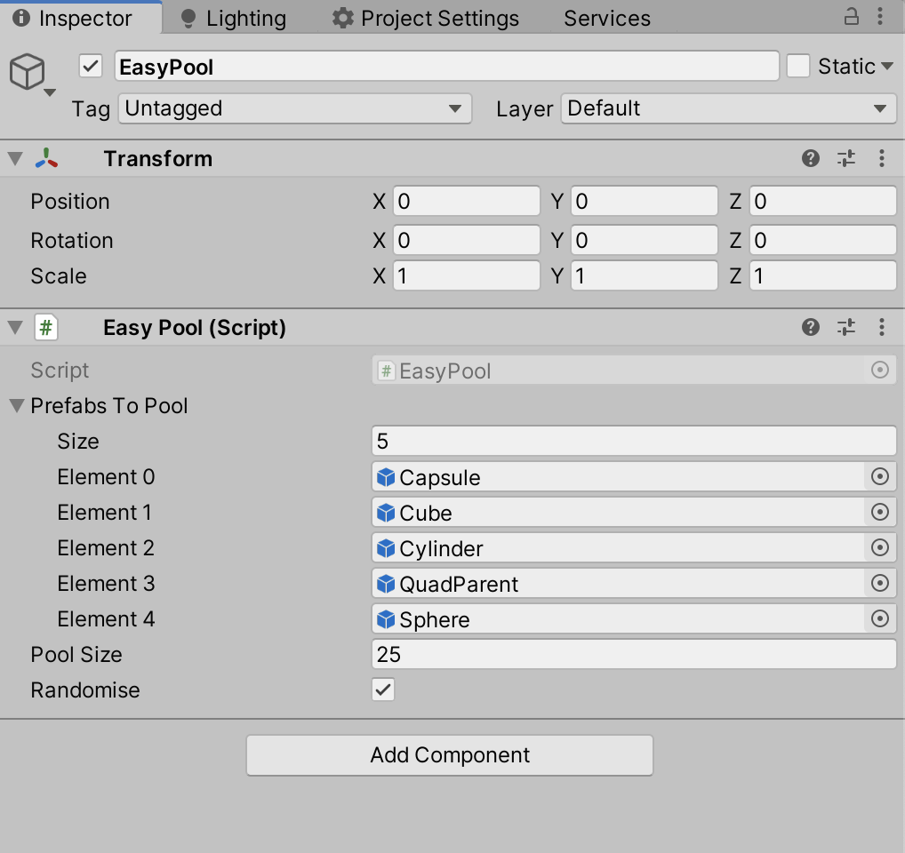

# Easy-Object-Pooling

Instantiating and Destroying objects in the scene during runtine is expensive in terms of memory management. Object pooling is a solution to this problem which allows us to save memory and improve performance.

## How does it work?

1. All objects are loaded into a pool "once" during initialization
2. These objects can then be retrieved from the pool when required 
3. And returned back to the pool when not required

**Advantage:** Using this approach allows us to completely abandon calling Instantiate and Destroy funcations during runtime.

## How to use:

1. Attach the `EasyPool.cs` script to any gameobject in the scene (it's a singleton, but still, just ensure there is only one instance in the scene to avoid any odd scenario).
2. Add the prefabs of your choice in the PrefabsToPool list.
3. Mention the pool size (default size is 25).
4. Check Randomise if you want to retrive objects at rondom from the pool. If unchecked, the objects will be obtained sequentialy similar to a Queue.
5. To retrive, Call `EasyPool.Instance.GetObj()` in any other scipt where you need to load objects. 

**Note:** 
-> Incude the namespace, `using Hims.Arsenal;` to access the EasyPool class in your scripts.
-> The game object obtained in the above step is disabled by default, enable it by calling the SetActive() function on it.

6. To return, Call `EasyPool.Instance.ReturnObj(obj)` where obj is the object you no longer need. 

That's it! 

The "EasyPoolExample" scene inside the Scenes folder shows the implementation with an `ExampleSpawn.cs` script included for your assistance.
